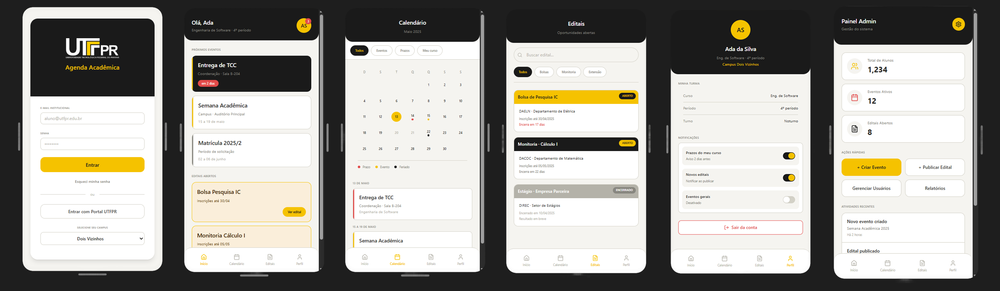

# Agenda Acadêmica UTFPR

Aplicativo mobile em React Native para centralizar eventos, prazos acadêmicos e editais da universidade.  

Funcionalidades principais:  
- Filtragem de eventos por curso e campus  
- Notificações inteligentes de prazos importantes  
- Painel administrativo para coordenações cadastrarem eventos  

---

## Telas mapeadas até o momento
1. Login  
2. Tela inicial  
3. Calendário  
4. Detalhes do evento  
5. Editais  
6. Painel Administrativo  

---

## Protótipos das telas da aplicação

### Visualização rápida

### Arquivo vetorial original
[Ver versão em SVG](./docs/prototype.svg)

---

