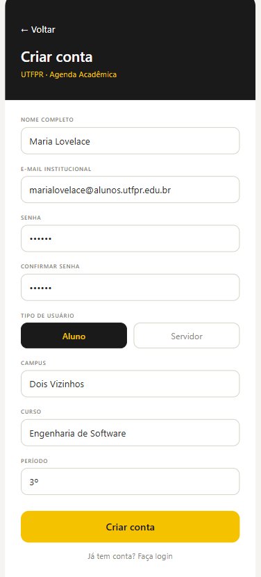
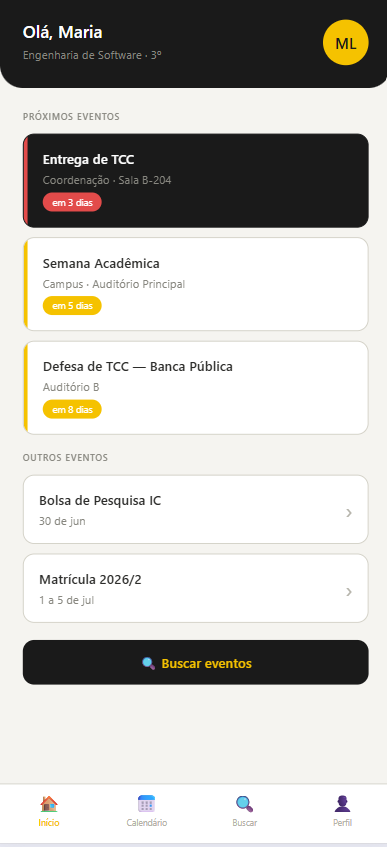
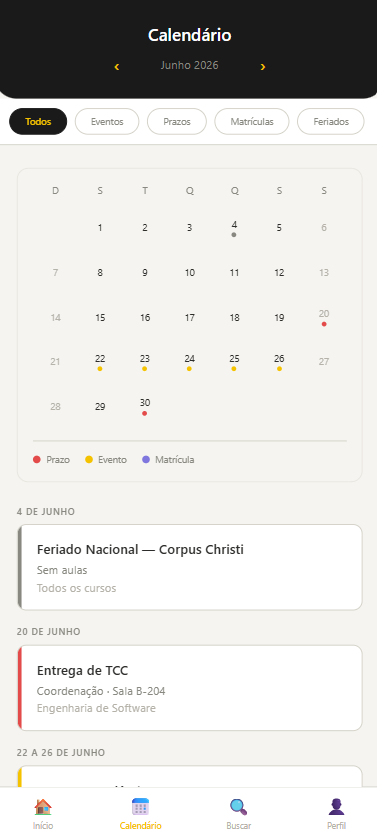
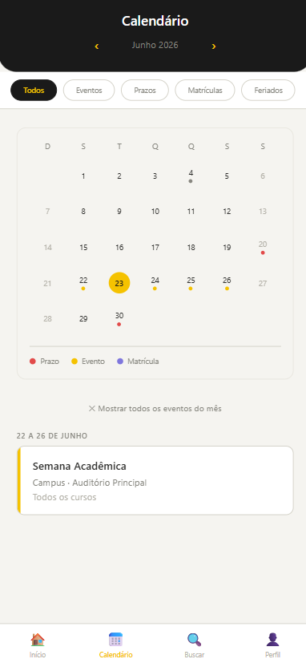
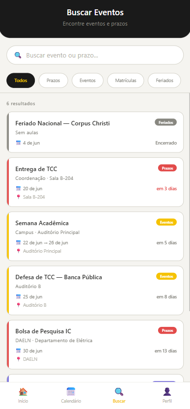
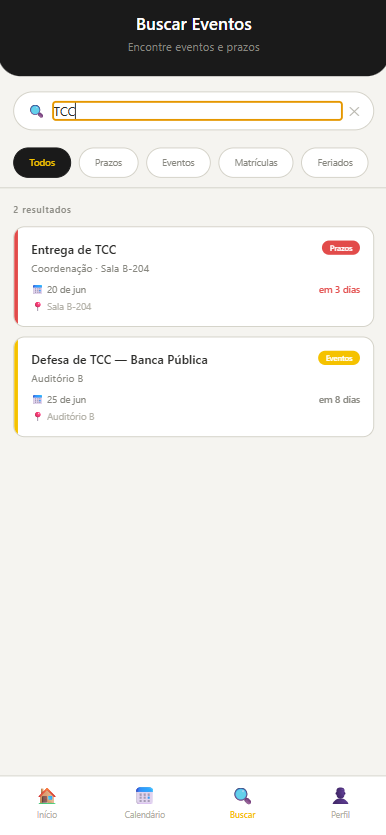
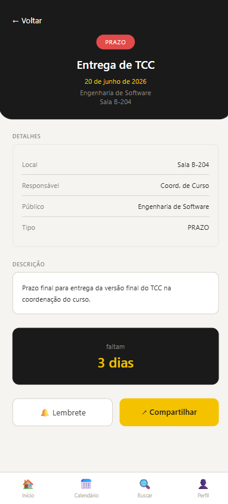
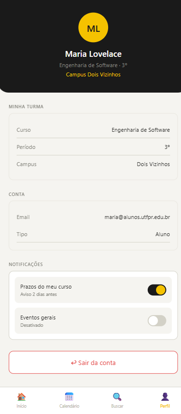
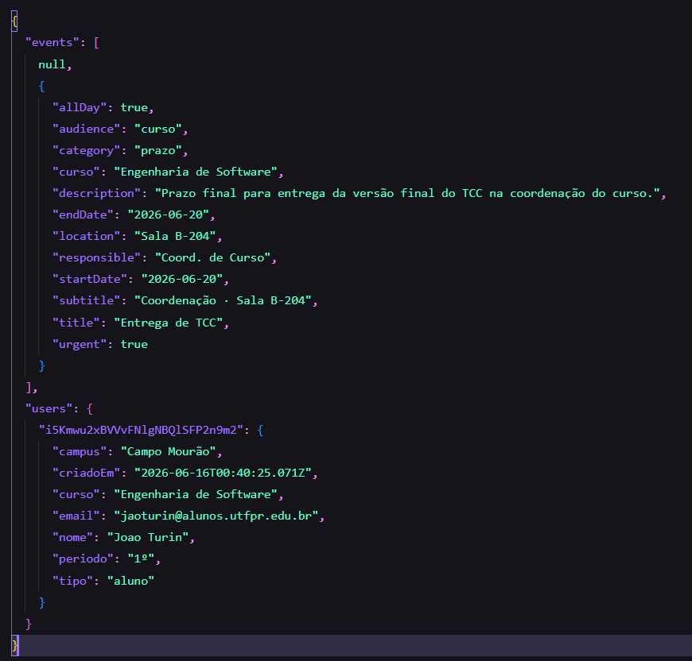

# Agenda Acadêmica UTFPR

Aplicativo mobile em React Native para centralizar eventos, prazos acadêmicos e editais da universidade.  
  

---

## Telas
1. Login
2. Cadastro
3. Tela inicial  
4. Calendário
5. Detalhes do evento
6. Busca de eventos
7. Perfil

---

## Tutarial de uso do aplicativo
Acesso ao Sistema
1. Caso não possua uma conta, selecione Criar uma.


2. Após finalizar o preenchimento de dados na tela de cadastro, você terá acesso a tela inicial.



3. Para Login informe e-mail e senha já cadastrados anteriormente.

Tela inicial
A tela inicial apresenta um resumo dos próximos eventos.


Calendário
Na tela de calendário é possível ver todos os eventos do mês, navegar para s próximos meses e filtrar por dia.



Busca de eventos
Na tela de busca é possível filtrar por categorias fixas como por palavras.




Detalhe de eventos
É possível visualizar os detalhes de cada evento clicando neles.



Perfil do usuário
É possível visualizar os dados cadastrais em perfil.




## Protótipos das telas da aplicação

### Visualização rápida


### Arquivo vetorial original
<a href="./docs/prototype.svg" target="_blank">Ver versão vetorial (SVG)</a>

---

## Estrutura JSON BD
O arquico JSON está dentro de docs.


---

## Como rodar o projeto

### 1. **Clonar o repositório**
```bash
git clone https://github.com/laianemuckler/utfpr-campus-calendar.git
cd utfpr-campus-calendar
```

### 2. **Instalar dependências**
```bash
npm install
```

### 3. **Configurar variáveis de ambiente**
Criar um arquivo `.env.local` na raiz do projeto com as credenciais do Firebase:
```
EXPO_PUBLIC_FIREBASE_API_KEY=xxx
EXPO_PUBLIC_FIREBASE_AUTH_DOMAIN=xxx
EXPO_PUBLIC_FIREBASE_DATABASE_URL=xxx
EXPO_PUBLIC_FIREBASE_PROJECT_ID=xxx
EXPO_PUBLIC_FIREBASE_STORAGE_BUCKET=xxx
EXPO_PUBLIC_FIREBASE_MESSAGING_SENDER_ID=xxx
EXPO_PUBLIC_FIREBASE_APP_ID=xxx
```

### 4. **Rodar o projeto**
```bash
npx expo start
```

### 5. **Abrir no emulador/dispositivo**
- Pressionar `i` (iOS) ou `a` (Android)
- Ou escanear o QR code com Expo Go
